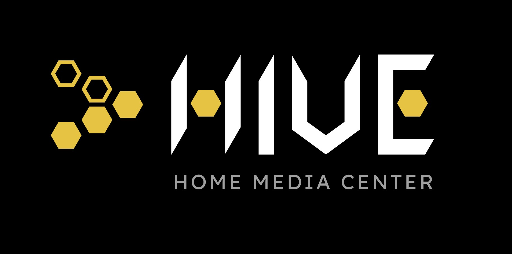
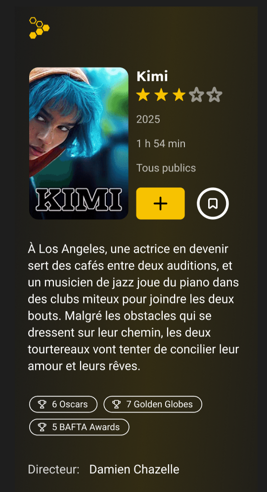
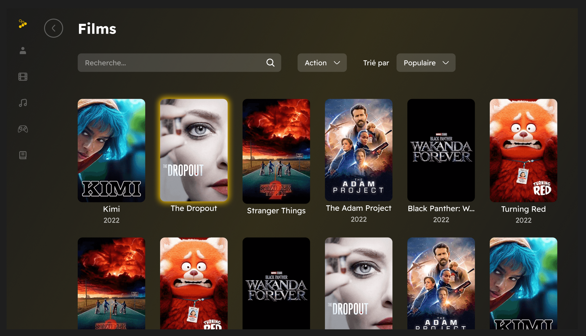

# 🧠 Hive - Home media center



## 📜 À propos du projet

**HIVE** est une application web de home média center permettant de centraliser vos collection de média et de partagez vos critiques avec les autres utilisateurs.

Vous pouvez gérer vos collections de :

- 🎬 Films
- 🎮 Jeux Vidéo
- 📖 Livres
- 🎵 Musique

## 🚀 Fonctionnalités

- 📚 Bibliothèque pour livres, films, jeux, musiques
- 🤓 Recherche intelligente
- 🔍 Système de filtre et de tri
- ⭐ Système de favoris et notations
- 🗒️ Rédiger des critiques
- 📩 S'inscrire à la newsletter

L'application est développée "mobile first". L'interface est donc responsive. La navigation dans le catalogue permet de filtrer et trier selon vos besoins.

## 📸 Démo / Screenshots




## 🛠️ Technologies utilisées

- **React** - Bibliothèque front-end pour la création d'interfaces utilisateur dynamiques
- **TypeScript** - Ajout du typage statique pour un code plus robuste
- **GraphQL** - Langage de requête pour API flexible et efficace
- **SQLite** - Système de gestion de base de données léger
- **TypeORM** - ORM pour TypeScript et JavaScript
- **APIs** : TMDb, Open Library, IGDB, Discogs

## 🛠️ Installation

Pour installer et exécuter ce projet localement, suivez ces étapes :

1. Clonez le dépôt

   ```bash
   git clone https://github.com/WildCodeSchool-CDA-FT-2025-03/projet1_cody.git
   cd home-center
   ```

2. Installez les dépendances au niveau racine

   ```bash
   npm install
   ```

3. Installez les dépendances du serveur

   ```bash
   cd server/
   npm install
   ```

4. Installez les dépendances du client

   ```bash
   cd ../client/
   npm install
   ```

5. Lance l'application au niveau racine

   ```bash
   cd ..
   npm run dev
   ```

## 🤝 Equipe de développement

Développé par [Alexandre Dumout](https://www.linkedin.com/in/alexandre-dumout-317505123/), [Romaric Yi](https://www.linkedin.com/in/yiromaric/) et [Ryan Decian](https://www.linkedin.com/in/ryan-decian-864696302/)

---

Ce projet est développé dans le cadre de la Formation "Développeur Concepteur d'Applications" de la [Wild Code School](https://www.wildcodeschool.com/)
